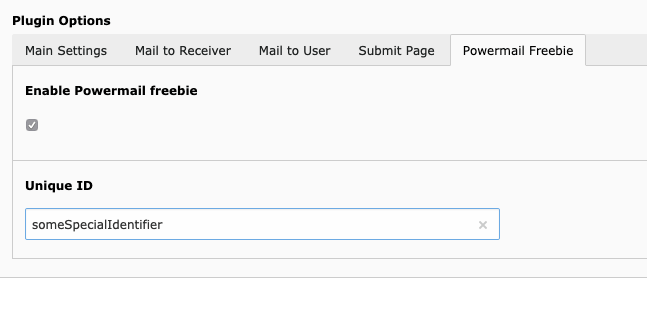

# TYPO3 Extension `powermail_freebie`

This extensions allows to show content elements only to those users who submitted a powermail form.

## Requirements

- TYPO3 8.7 - TYPO3 9.5 (not tested yet with 10 LTS)
- EXT:powermail 6x-8x

## Setup

Install the extension as any other extension. Install it by either using

 - `compose require studiomitte/powermail-freebie`
 - *or* install it via Extension Manager.

### TypoScript

Include the TypoScript from this extension by adding the following line to your project:

```
<INCLUDE_TYPOSCRIPT: source="FILE:EXT:powermail_freebie/Configuration/TypoScript/setup.txt">
```

**Important**: This extension uses a dataprocessor with the identifier *21* (`plugin.tx_powermail.settings.setup.dataprocessor.21`). Please check the TypoScript Object Browser if this dataprocessor is actually used and not overriden by another one.

## Usage

Using this extension is very simple. There are 2 different parts you need to fulfill to have the extension working:

### 1.) Powermail plugin

Open the powermail plugin and switch to the last tab called *Powermail Freebie* and fill out the 2 fields:

- Enable the powermail freebie functionality
- Provide a unique identifier. This is useful to have several different freebie forms on your site independently.



### 2.) Freebie page

**Important**: The cache of any freebie page is disabled!

Create any content element on a page (ideally the thank you page) and provide the same identifier as in the powermail plugin.


### Hide freebie content

If you want to hide the freebie content for editors again, just add the plugin "Powermail Freebie unset" on the freebie page.

